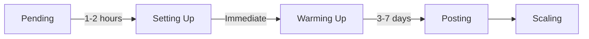

## The 4 Lifecycle Stages

## Stage 1: Pending ⏳

**What it means:** Account is created in Juice, waiting for automation to begin

**Duration:** A few minutes to a few hours

**What's happening:**
- Account queued in automation system
- Waiting for available automation slots
- Preparing for TikTok account creation

**What you see:**
- Status badge: "Pending"
- No profile picture yet
- No TikTok URL yet

**What you can do:**
- Assign content (will queue for later)
- Edit account settings
- Wait for automation to start

<Info>
Most accounts move from Pending to Setting Up within 30 minutes.
</Info>

## Stage 2: Setting Up 🔧

**What it means:** Juice is creating the account on TikTok

**Duration:** 1-3 hours

**What's happening:**
- Automated browser creates TikTok account
- Sets up profile (username, bio, picture)
- Verifies account
- Prepares for warmup

**What you see:**
- Status badge: "Setting Up" or "Creating Account"
- Progress indicator
- Automation task tracking (if you click into account)

**What you can do:**
- Wait (no action needed)
- Assign content (will start posting after warmup)
- Monitor progress from account detail page

<Warning>
**Don't worry if setup takes a few hours.** TikTok's account creation has rate limits. Juice handles this automatically.
</Warning>

## Stage 3: Warming Up 🔥

**What it means:** Building account trust with TikTok's algorithm before posting

**Duration:** 3-7 days (varies by account)

**What's happening:**
Juice uses the app to make the account authentic:

| Day | Activity |
|-----|----------|
| **Day 1-2** | Search sessions in your niche |
| **Day 3-4** | Search + profile browsing + following |
| **Day 5-6** | Search + views + follows + likes |
| **Day 7+** | **Posting begins** |

**What you see:**
- Status badge: "Warming Up"
- Warmup day counter (Day 1, Day 2, etc.)
- No posts yet
- Activity log (searches, views performed)

**What you can do:**
- Assign content (it will queue)
- Monitor warmup progress
- Wait patiently

### Why Warmup Matters

**Without warmup:**
- Brand-new account immediately posts 3x/day
- TikTok flags as spam/bot
- Account gets shadowbanned
- Zero views on posts
- Account potentially banned

**With warmup:**
- Account behaves like real user first
- Gradually builds trust with algorithm
- First posts get proper distribution
- 10K-100K+ views possible on early posts

<Tip>
**Warmup is required, not optional.** All successful TikTok automation uses warmup. Be patient - it's worth it.
</Tip>

### Monitoring Warmup

From the account detail page, you can see:

**Warmup day counter:**
- Day 1 of 7
- Day 4 of 7
- etc.

**Recent activity:**
- Searches performed
- Profiles viewed
- Videos watched
- Time spent active

**Progress bar:**
- Visual indicator of warmup completion

## Stage 4: Posting ✅

**What it means:** Account is fully active and posting your content

**Duration:** Ongoing

**What's happening:**
- Automated posting based on schedule (1-3x per day)
- Content rotates through assigned pieces
- Performance tracking begins
- Engagement and growth tracked

**What you see:**
- Status badge: "Active" or "Posting"
- Posts appear in account feed
- View counts, likes, comments
- Follower growth

**What you can do:**
- Monitor performance
- Assign more content
- Adjust posting frequency
- Download posted videos

### Posting Schedule

Once posting starts, each account follows its frequency setting:

**1x per day:**
- Posts once daily at optimal time
- ~7 posts per week

**2x per day:**
- Posts twice daily (morning + evening)
- ~14 posts per week

**3x per day:**
- Posts three times daily
- ~21 posts per week

<Info>
Posting times are algorithm-optimized. Juice handles scheduling automatically - no need to set specific times.
</Info>

### Content Rotation

If an account has multiple content pieces assigned:
- Day 1: Posts Content A (Variation 1)
- Day 2: Posts Content B (Variation 3)
- Day 3: Posts Content C (Variation 2)
- Day 4: Rotates back to Content A (or next in queue)

**This prevents repetition** and keeps content fresh.

## Stage 5: Scaling (Progression Milestones)

After initial posting, accounts progress through milestones:

<Steps>
  <Step title="First Post">
    Account posts its first TikTok
  </Step>

  <Step title="Cross-Posting Enabled">
    After 7 days of posting, can enable Instagram/YouTube
  </Step>

  <Step title="2x Per Day">
    After 14 days, increase frequency
  </Step>

  <Step title="3x Per Day">
    After 30 days, maximum posting frequency
  </Step>
</Steps>

**Each milestone unlocks more capabilities** as the account proves itself to the algorithm.

## Account Status Reference

Quick reference for all statuses:

| Status | What It Means | Typical Duration |
|--------|---------------|------------------|
| 🟡 **Pending** | Queued for creation | Minutes to hours |
| 🔵 **Setting Up** | Creating on TikTok | 1-3 hours |
| 🟠 **Warming Up** | Building algorithm trust | 3-7 days |
| 🟢 **Posting** | Actively posting content | Ongoing |
| ⚪ **Paused** | Temporarily stopped | Until resumed |
| 🔴 **Archived** | Deactivated | Permanent (unless restored) |

## Troubleshooting Lifecycle Issues

### Account Stuck in "Setting Up"

**Cause:** TikTok rate limits or verification issues

**Solution:** 
- Wait 12-24 hours
- If still stuck, contact support

### Warmup Taking Longer Than 7 Days

**Cause:** Some accounts need extended warmup for algorithm trust

**Solution:**
- Normal - can take up to 10 days for some accounts
- Don't manually intervene
- Contact support if &gt;14 days

### Account Not Posting After Warmup

**Cause:** No content assigned OR content is inactive

**Solution:**
- Check account detail → Assigned Content
- Verify content is set to "Active"
- Assign content if none exists

### Posts Getting Zero Views

**Cause:** Possible shadowban or content quality issue

**Solution:**
- Check TikTok account directly for violations
- Try different content
- Contact support for account review

## Expected Timelines

### From Creation to First Post

**Optimal scenario:** 7 days
- Day 0: Create account
- Day 0-1: Setup completes
- Day 1-7: Warmup
- Day 7: First post

**Realistic scenario:** 8-10 days
- Accounts may take extra time for setup/warmup
- This is normal and healthy

### From First Post to Good Performance

**Week 1-2:** Building momentum (expect 1K-5K views per post)
**Week 3-4:** Finding groove (5K-10K average)
**Week 5+:** Established (10K-50K+ with good content)

<Tip>
**Patience pays off.** Accounts that post consistently for 30+ days see 3-5x better performance than accounts that post for 7 days then stop.
</Tip>

## Account Longevity

How long do accounts last?

**Typical account lifespan:**
- 6-12 months of active posting
- Then performance may plateau
- Rotate in fresh accounts as needed

**Best practice:**
- Create accounts in batches
- Stagger creation times
- Always have accounts in warmup
- Replace underperformers every 90 days

## Monitoring Account Health

Check these indicators weekly:

✅ **Healthy account:**
- Posting consistently (check Posts count increases)
- Views stable or growing
- No violations/warnings
- Follower count slowly growing

⚠️ **At-risk account:**
- Views suddenly dropped 80%+
- Account stopped posting
- Violation warnings
- Engagement completely dead

❌ **Unhealthy account:**
- Shadowbanned (confirmed)
- Posting but zero views for 14+ days
- Account flagged by TikTok

**Action:** Archive unhealthy accounts and create replacements.

## Progression Tracking

Juice shows progression milestones on account detail pages:

**Milestones:**
- ✅ Account created
- ✅ Warmup started
- ✅ First post
- ⏳ Cross-posting enabled
- ⏳ 2x per day milestone
- ⏳ 3x per day milestone

**Each milestone** is timestamped so you can track account maturity.

## Next Steps

<CardGroup cols={2}>
  <Card title="Create Accounts" icon="user-plus" href="/accounts/creating-accounts">
    Start the lifecycle by creating accounts
  </Card>
  
  <Card title="Account Settings" icon="gear" href="/accounts/account-settings">
    Configure posting and preferences
  </Card>
  
  <Card title="Assign Content" icon="rectangle-history" href="/content-creation/step-6-assigning-accounts">
    Queue content for posting
  </Card>
  
  <Card title="Monitor Dashboard" icon="chart-line" href="/analytics/dashboard-overview">
    Track account performance
  </Card>
</CardGroup>
