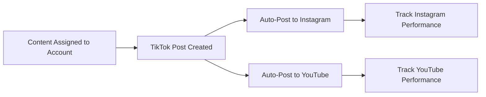

## What is Cross-Posting?

When cross-posting is enabled:
- Every TikTok post automatically goes to Instagram and/or YouTube
- Same video, same caption
- Posted simultaneously or minutes apart
- Separate analytics per platform

**Use case:** Maximize organic reach across all short-form video platforms.

## Supported Platforms

<CardGroup cols={2}>
  <Card title="Instagram Reels" icon="instagram">
    Auto-post to your Instagram account's Reels feed
  </Card>
  
  <Card title="YouTube Shorts" icon="youtube">
    Auto-post to your YouTube channel's Shorts feed
  </Card>
</CardGroup>

**Coming soon:** Twitter/X video posts, LinkedIn video

## Enabling Cross-Posting

### For Instagram Reels

<Steps>
  <Step title="Go to Account Settings">
    Click account → Settings tab
  </Step>

  <Step title="Toggle Instagram Cross-Posting">
    Turn on Instagram Reels toggle
  </Step>

  <Step title="Connect Instagram Account">
    Popup appears to authenticate:
    - Login with Instagram credentials
    - Authorize Juice to post on your behalf
  </Step>

  <Step title="Confirmation">
    Connection successful - cross-posting enabled
  </Step>
</Steps>

**Requirement:** Instagram Business or Creator account

### For YouTube Shorts

<Steps>
  <Step title="Go to Account Settings">
    Click account → Settings tab
  </Step>

  <Step title="Toggle YouTube Cross-Posting">
    Turn on YouTube Shorts toggle
  </Step>

  <Step title="Connect YouTube Channel">
    Authenticate with Google:
    - Select YouTube channel
    - Grant posting permissions
  </Step>

  <Step title="Confirmation">
    Connection successful
  </Step>
</Steps>

**Requirement:** YouTube channel (any size)

## When to Enable Cross-Posting

<Warning>
**Don't enable cross-posting immediately.** Wait until TikTok performance is proven.
</Warning>

### Recommended Timeline

| Platform | Enable After | Why |
|----------|--------------|-----|
| **TikTok** | Day 1 (primary) | - |
| **Instagram** | 14+ days on TikTok | Verify content performs first |
| **YouTube** | 30+ days on TikTok | Ensure you have winning content |

### Performance Criteria

**Enable Instagram when:**
- Account averaging 10K+ views per TikTok
- Content consistently hits 5K+ views
- You've identified winning content

**Enable YouTube when:**
- Instagram cross-posting is successful
- TikTok views consistently &gt;25K
- You're ready for another distribution channel

## Platform-Specific Considerations

### TikTok vs Instagram Reels

**Similarities:**
- Short-form vertical video
- Algorithm-driven discovery
- Similar content performs well

**Differences:**
- Instagram: More polished, aesthetic-focused
- TikTok: Raw, authentic, trend-driven
- Instagram: Follower-feed hybrid
- TikTok: Pure algorithmic feed

**Impact:** Content that works on TikTok usually works on Instagram, but may perform differently.

### TikTok vs YouTube Shorts

**Similarities:**
- Vertical video format
- Designed for mobile viewing
- Short-form content

**Differences:**
- YouTube: Longer viewer attention spans
- TikTok: Faster scroll, need instant hooks
- YouTube: Connected to long-form content
- TikTok: Standalone short-form platform

**Impact:** Educational content often performs better on YouTube Shorts than TikTok.

## Cross-Posting Workflow

Once enabled, cross-posting is automatic:

**You do nothing.** Juice handles everything.

## Performance Across Platforms

Expect different results per platform:

### Typical Performance Ratios

If a TikTok post gets 10K views:
- Instagram Reels: 3K-7K views (30-70% of TikTok)
- YouTube Shorts: 5K-15K views (50-150% of TikTok)

<Info>
**YouTube Shorts can outperform TikTok** for educational/tutorial content. Test and see!
</Info>

## Managing Cross-Posted Content

### Viewing Cross-Posted Analytics

From the post detail page:
- See TikTok performance
- See Instagram performance
- See YouTube performance
- Compare across platforms

### Disabling Cross-Posting

Turn off anytime:

<Steps>
  <Step title="Go to Account Settings">
    Navigate to the account
  </Step>

  <Step title="Toggle Off">
    Disable Instagram and/or YouTube toggle
  </Step>

  <Step title="Stops Cross-Posting">
    Future posts only go to TikTok
    
    **Already cross-posted content stays live**
  </Step>
</Steps>

## Platform-Specific Optimization

### Instagram Reels Tips

**Works better on Instagram:**
- More polished, aesthetic content
- Brand-forward messaging
- Lifestyle/aspirational content

**Adjust for Instagram:**
- Use "Edit" Image Mode for polish
- Include brand logo/watermark
- More product-focused content

### YouTube Shorts Tips

**Works better on YouTube:**
- Educational, in-depth content
- How-to guides
- Longer viewer retention content (20-30 seconds)

**Adjust for YouTube:**
- Use templates with more slides
- More detailed explanations
- Clearer CTAs to long-form content

## Best Practices

### Test TikTok First

**Always** validate content on TikTok before cross-posting:
- Post to TikTok only for 7-14 days
- Identify winning content
- Then enable cross-posting

**Why:** TikTok has the most aggressive algorithm. If it works there, it'll work everywhere.

### Platform-Specific Content

**Consider creating:**
- TikTok-only accounts (raw, trendy)
- Instagram-only accounts (polished, aesthetic)
- Omnichannel accounts (cross-post everything)

**Test which performs best** for your brand.

### Monitor Each Platform

Don't assume same performance:
- Check Instagram Insights
- Check YouTube Studio
- Adjust strategy per platform

## Troubleshooting

### Instagram Connection Failed

**Cause:** Instagram requires Business/Creator account

**Solution:**
- Convert to Business account in Instagram settings
- Reconnect in Juice

### YouTube Upload Errors

**Cause:** YouTube API limits or account restrictions

**Solution:**
- Verify YouTube channel is in good standing
- Check for copyright strikes
- Contact support if persists

### Different Captions per Platform

**Currently:** Same caption on all platforms

**Workaround:** Edit caption manually on Instagram/YouTube after posting (not ideal)

**Future feature:** Platform-specific captions coming soon

## Next Steps

<Card title="Enable Cross-Posting" icon="share-nodes" href="https://dashboard.juice.co/accounts">
  Go to your accounts and enable cross-posting
</Card>
