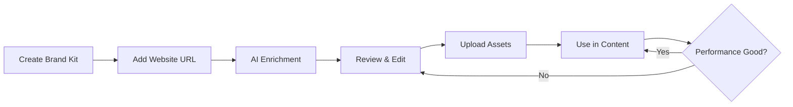

## What is Brand Hub?

Brand Hub lets you create and manage **Brand Kits** - collections of brand information that guide AI content generation.

Each Brand Kit contains:
- **Brand Information** - About your brand, products, audience
- **Visual Identity** - Colors, logos, typography
- **Voice & Tone** - How you communicate
- **TikTok Targeting** - Algorithm keywords and hashtags
- **Brand Assets** - Logos, product images, graphics

<Info>
**Think of Brand Kits as profiles for different brands.** If you manage multiple brands (or sub-brands), create separate Brand Kits for each.
</Info>

## Why Brand Kits Matter

Your Brand Kit is what makes AI-generated content sound and look like **your brand**, not generic content.

### Without a Brand Kit:
- AI generates generic content
- No consistent voice
- Random visual styling
- Doesn't target your audience

### With a Brand Kit:
- AI matches your brand voice
- Uses your colors and fonts
- Incorporates your logos
- Targets your specific niche
- References your products/services

**Example:**

**Topic:** "3 ways to improve productivity"

**Without Brand Kit:**
- Generic productivity tips
- Stock images of desk setups
- Casual, general tone

**With Brand Kit (SaaS company):**
- "3 ways [Your SaaS] improves team productivity"
- Screenshots of your product
- Professional tone targeting remote teams
- Your brand colors throughout

## Brand Hub Features

### Create Multiple Brand Kits

Manage multiple brands from one Juice account:

<CardGroup cols={3}>
  <Card title="Main Brand" icon="building">
    Your primary company
  </Card>
  
  <Card title="Product Lines" icon="box">
    Different products/divisions
  </Card>
  
  <Card title="Client Brands" icon="briefcase">
    For agencies managing clients
  </Card>
</CardGroup>

### AI Brand Enrichment

Upload a website URL and Juice's AI automatically extracts:
- Brand description
- Product/service details
- Target audience
- Competitors
- Brand voice
- Visual style

[→ Learn about enrichment](/brand-hub/enriching-brand-kit)

### Brand Asset Library

Upload and manage:
- Company logos (used in branded accounts)
- Product photos (used in content generation)
- Brand graphics (used as reference images)

[→ Manage brand assets](/brand-hub/brand-assets)

## Viewing Your Brand Kits

Access Brand Hub from the sidebar:

<Steps>
  <Step title="Click 'Brand Hub'">
    In the main sidebar
  </Step>

  <Step title="See All Brand Kits">
    Grid view of all your brand kits showing:
    - Brand name
    - Logo
    - Website URL
    - Enrichment status
    - Asset count
  </Step>

  <Step title="Click to Edit">
    Click any brand kit to view details and edit
  </Step>
</Steps>

## Active Brand Kit

When creating content, you select which Brand Kit to use. The active Brand Kit:

- Provides voice and tone for AI
- Supplies colors and visual style
- Targets content to your audience
- Generates relevant topic suggestions

**Switching Brand Kits:** Click the Brand Kit dropdown in the content generator to switch brands mid-flow.

## Common Use Cases

### Single Brand Company

**Setup:** 1 Brand Kit

Create one comprehensive Brand Kit with all your brand information. Use it for all content creation.

### Multi-Product Company

**Setup:** 2-3 Brand Kits

**Example:** A company with B2B SaaS + B2C mobile app

- Brand Kit 1: B2B SaaS → Professional tone, enterprise audience
- Brand Kit 2: B2C App → Casual tone, consumer audience

Each generates appropriate content for its audience.

### Agency with Multiple Clients

**Setup:** 1 Brand Kit per client

**Example:** Agency managing 5 clients

- Client A Brand Kit
- Client B Brand Kit
- Client C Brand Kit
- etc.

Switch between clients when creating content.

## Brand Kit Workflow

The typical Brand Kit lifecycle:

1. **Create** Brand Kit with basic info
2. **Enrich** with AI analysis
3. **Review** and edit fields
4. **Upload** logos and assets
5. **Use** in content creation
6. **Monitor** content performance
7. **Refine** brand kit based on results

## Getting Started

Ready to create your first Brand Kit?

<Card title="Create Your First Brand Kit" icon="plus" href="/brand-hub/creating-brand-kit">
  Step-by-step guide to Brand Kit creation
</Card>

## Quick Links

<CardGroup cols={2}>
  <Card title="Enriching Brand Kits" icon="sparkles" href="/brand-hub/enriching-brand-kit">
    Use AI to improve your brand information
  </Card>
  
  <Card title="Managing Assets" icon="images" href="/brand-hub/brand-assets">
    Upload and organize brand visuals
  </Card>
  
  <Card title="Using in Content" icon="wand-magic" href="/content-creation/step-2-choosing-topic">
    See how Brand Kits affect content
  </Card>
</CardGroup>
