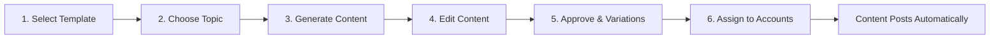

## What is the Content Generator?

The Content Generator is an AI-powered tool that creates slideshow-style TikTok videos:

- **Input:** A template + a topic (e.g., "3 ways to improve team productivity")
- **Output:** A complete video with images, text overlays, and animations
- **Time:** 15-30 seconds to generate

### What You Get

Each generated piece of content includes:
- **6-10 slides** (varies by template)
- **Unique images** for each slide (AI-generated or from your references)
- **Text overlays** formatted to match the template
- **Animations** optimized for viewer retention
- **Real-time preview** on a phone mockup

## The 6-Step Content Creation Process

Creating content in Juice follows a simple flow:

### Step 1: Select Template

Browse 50+ templates and pick one that matches your content style.

[→ Learn more about selecting templates](/content-creation/step-1-selecting-template)

### Step 2: Choose Topic

AI suggests topics based on your Brand Kit, or write your own custom topic.

[→ Learn more about choosing topics](/content-creation/step-2-choosing-topic)

### Step 3: Generate Content

Click a topic and watch AI create your video in real-time.

[→ Learn more about content generation](/content-creation/step-3-generating-content)

### Step 4: Edit Content

Refine your content with simple text prompts like "make the background darker" or "change slide 3's image."

[→ Learn more about editing content](/content-creation/step-4-editing-content)

### Step 5: Approve & Create Variations

Lock in your final design. Juice generates 10+ unique variations for different accounts.

[→ Learn more about approving content](/content-creation/step-5-approving-content)

### Step 6: Assign to Accounts

Choose which accounts should post this content, or use AI auto-selection.

[→ Learn more about assigning accounts](/content-creation/step-6-assigning-accounts)

## Key Features

### Real-Time Phone Preview

As AI generates content, you see it immediately on a phone mockup. Click through slides, watch animations, and verify everything looks perfect before approving.

### Unlimited Iterations

Don't like something? Edit it. There's no limit on iterations:
- Generate initial content
- Edit 5 times to perfect it
- Each edit takes ~15 seconds

### Reference Images

Guide the AI with your own images (Midjourney-style):
- Upload product photos
- Provide style inspiration
- Control exactly what appears

[→ Master reference images](/content-creation/using-references)

### Advanced Controls

Fine-tune generation with:
- **Image Mode** - Original/Edit/New
- **Creative Control** - Conservative to experimental
- **Slide-Specific Edits** - Target individual slides

[→ Learn advanced settings](/content-creation/advanced-settings)

### History & Iteration Tracking

Every edit is tracked. View iteration history to:
- See what changes you made
- Revert to previous versions
- Understand AI's decision-making

## Content Types You Can Create

Juice works for any short-form content:

<CardGroup cols={2}>
  <Card title="Educational" icon="graduation-cap">
    "3 ways to...", "How to...", tutorials
  </Card>
  
  <Card title="Product Features" icon="sparkles">
    Feature showcases, use cases, demos
  </Card>
  
  <Card title="Thought Leadership" icon="lightbulb">
    Industry insights, hot takes, predictions
  </Card>
  
  <Card title="Social Proof" icon="trophy">
    Results, case studies, testimonials
  </Card>
  
  <Card title="Problem/Solution" icon="check-circle">
    Pain point → Your solution
  </Card>
  
  <Card title="Storytelling" icon="book">
    Founder story, customer journey, origin
  </Card>
</CardGroup>

## Common Workflows

### Workflow 1: Quick Content (5 minutes)

1. Open Content Generator
2. Pick a template
3. Select an AI-suggested topic
4. Generate content
5. Approve (no edits)
6. Assign to accounts

**Use when:** You trust the template and just need volume

### Workflow 2: Polished Content (15 minutes)

1. Open Content Generator
2. Pick a template
3. Write custom topic
4. Generate content
5. Edit images and copy (2-3 iterations)
6. Add reference images for brand consistency
7. Approve
8. Assign to accounts

**Use when:** You want high-quality, on-brand content

### Workflow 3: Product Content (20 minutes)

1. Upload product photos to Assets library
2. Open Content Generator
3. Pick a product showcase template
4. Write topic describing your product
5. Generate content
6. Add product photos as Image References (Original mode)
7. Edit text to highlight features
8. Approve
9. Assign to branded accounts

**Use when:** You're showcasing a specific product/feature

## Time Investment

How long does content creation actually take?

| Task | Time | Frequency |
|------|------|-----------|
| Generate 1 content piece | 2 min | As needed |
| Edit 1 content piece | 5-10 min | Per piece |
| Batch create 10 pieces | 30-40 min | Weekly |
| Review and approve | 2 min | Per piece |

**Typical weekly workflow:** 60 minutes to create and approve 10 content pieces = enough for 6 accounts posting 2x/day for 1 week.

<Tip>
**Batch content creation works well.** Set aside 1 hour on Monday to create all content for the week.
</Tip>

## What Makes Great AI-Generated Content?

The AI is powerful, but you guide it. Here's what separates good from great:

### Great AI Prompts

**Topic prompts that work:**
- Clear and specific
- Include target outcome
- Mention audience if relevant

**Examples:**
- ✅ "How CFOs can cut software costs by 30% without losing functionality"
- ✅ "3 mistakes first-time founders make when hiring engineers"
- ❌ "Software tips"
- ❌ "Hiring advice"

### Great Reference Images

**What works:**
- High-resolution (1080p+)
- Clear subject
- Good lighting
- Minimal background clutter

**What doesn't:**
- Screenshots with UI elements
- Blurry phone photos
- Busy backgrounds
- Low-resolution images

## Content Library Management

As you create and approve content, it builds your library:

### Approved Content Library

Access all approved content from **Content** in the sidebar:
- View all variations
- See which accounts it's assigned to
- Edit settings (posting frequency, active/inactive)
- Duplicate to create new versions

### Content Organization

Best practices for staying organized:
- Use clear topic descriptions when generating
- Tag content by template type
- Review performance monthly and archive low performers

## Next Steps

Ready to create your first content? Follow these guides in order:

<CardGroup cols={3}>
  <Card title="Step 1: Select Template" icon="rectangle-history" href="/content-creation/step-1-selecting-template" />
  
  <Card title="Step 2: Choose Topic" icon="message-pen" href="/content-creation/step-2-choosing-topic" />
  
  <Card title="Step 3: Generate Content" icon="wand-magic-sparkles" href="/content-creation/step-3-generating-content" />
  
  <Card title="Step 4: Edit Content" icon="pen" href="/content-creation/step-4-editing-content" />
  
  <Card title="Step 5: Approve & Variations" icon="circle-check" href="/content-creation/step-5-approving-content" />
  
  <Card title="Step 6: Assign Accounts" icon="users" href="/content-creation/step-6-assigning-accounts" />
</CardGroup>

## Advanced Features

Once you've mastered the basics, explore these power-user features:

<CardGroup cols={3}>
  <Card title="Advanced Settings" icon="sliders" href="/content-creation/advanced-settings">
    Image modes, creative control, and more
  </Card>
  
  <Card title="Using References" icon="images" href="/content-creation/using-references">
    Master Midjourney-style image prompts
  </Card>
  
  <Card title="Editing Techniques" icon="pen-ruler" href="/content-creation/editing-techniques">
    Add, remove, reorder, and refine slides
  </Card>
</CardGroup>
