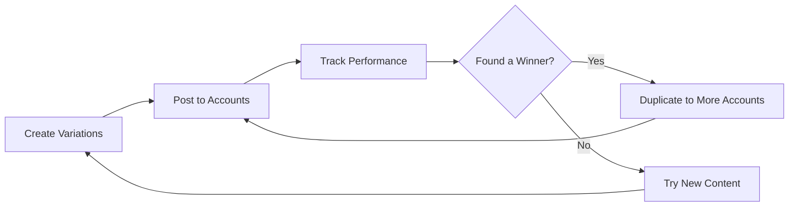

## The Shift to Algorithmic Distribution

TikTok has fundamentally changed how content gets discovered:

### Old Model: Follower Feeds
- Content shown primarily to followers
- Growth limited by follower count
- One account = one audience

### New Model: Content Recommendation Feeds
- Content shown to anyone who might be interested
- Growth driven by engagement signals
- Algorithm determines reach, not followers

<Info>
**Key Insight:** On TikTok, a brand-new account with 0 followers can get 100K+ views on its first post if the content resonates with the algorithm.
</Info>

This shift makes multi-account strategies not just viable, but **optimal**. More accounts = more content = more algorithmic shots = more growth.

## Why Multiple Accounts?

Juice helps you run 6, 12, or 18+ accounts simultaneously. Here's why this works:

### Testing at Scale

With one account, you post once per day = 1 data point.  
With 6 accounts, you post 6 times per day = 6 data points.

**More tests = faster learning** about what content performs.

### Different Personas Reach Different Audiences

A **branded account** (your company logo, professional tone) attracts one type of viewer.  
A **faceless account** (generic visuals, educational focus) attracts another.  
A **UGC account** (person-based, relatable) attracts yet another.

Each persona taps into different algorithmic recommendation patterns.

### Algorithmic Diversification

TikTok's algorithm is unpredictable. One account might get suppressed while another takes off. **Multiple accounts = built-in insurance**.

If one account gets flagged or performs poorly, your other accounts keep running.

### Volume Creates Visibility

The algorithm rewards consistent posting:
- 1 account posting 1x/day = 7 posts per week
- 6 accounts posting 3x/day = 126 posts per week

**More content in the algorithm = more chances to go viral.**

## The Content Testing Loop

Here's how you use Juice to find and scale winning content:

### The Process

1. **Create 10 variations** of a content idea using one template
2. **Post across 6 accounts** (each gets unique variation)
3. **Wait 3-7 days** to see performance
4. **Identify winners** (posts with 10K+ views, high engagement)
5. **Scale winners** by duplicating to more accounts
6. **Kill losers** and test new ideas

<Tip>
**Pro Strategy:** Run 3-4 content templates simultaneously. Whichever template performs best after 7 days becomes your main content style for the next 30 days.
</Tip>

## Understanding Account Warmup

When you create a new TikTok account, you can't just immediately start posting. The algorithm needs to trust the account first.

### What is Warmup?

Warmup is a 3-7 day period where Juice uses the account:

- **Search sessions** - Searching for content in your niche
- **Profile views** - Viewing other accounts
- **Watch sessions** - Watching videos
- **Gradual activity** - Building up slowly over days

### Why Warmup Matters

Brand-new accounts that immediately spam content get flagged as bots. Warmed-up accounts that behave like real users get:
- Better initial reach
- Higher engagement rates
- Lower shadowban risk

### Warmup Timeline

| Day | Activity |
|-----|----------|
| 1-2 | Search sessions only |
| 3-4 | Searches + profile views |
| 5-6 | Searches + views + following |
| 7+ | **Posting begins** |

<Info>
You'll see accounts in "Warming Up" status with a day counter. Once warmup completes, posting starts automatically.
</Info>

## How Posting Works

Once accounts are warmed up, Juice handles everything automatically:

### Automated Posting Schedule

- **No manual posting** - Juice posts for you
- **Optimal timing** - Posts go out when the algorithm is most active
- **Frequency control** - Set 1x, 2x, or 3x per day per account

### Content Rotation

Each account posts a unique variation of your approved content:
- Account 1 gets Variation A
- Account 2 gets Variation B
- Account 3 gets Variation C
- And so on...

**This prevents duplication** and maximizes algorithmic distribution.

### Scaling Up

As accounts perform well, you can increase posting frequency:
- **Week 1-2**: 1x per day (building trust)
- **Week 3-4**: 2x per day (scaling)
- **Week 5+**: 3x per day (full speed)

## The Juice Advantage

Traditional TikTok marketing:
- Hire video editor
- Manually create content
- Post from 1-2 accounts
- Limited testing capacity
- Time-intensive

**With Juice:**
- AI generates content in seconds
- Deploy to 6-18 accounts automatically
- Test dozens of variations per week
- Hands-free posting
- Focus on strategy, not execution

## What Makes Content Perform?

The algorithm favors content that:

1. **Hooks in 1-2 seconds** - Grabs attention immediately
2. **Holds attention** - People watch to the end
3. **Generates engagement** - Likes, comments, shares
4. **Prompts saves** - Valuable enough to save for later

Juice templates are designed around these principles. Your job is to fill them with your brand's message and value proposition.

## Next Steps

<CardGroup cols={2}>
  <Card title="Content Strategy" icon="chart-line" href="/essentials/content-strategy">
    Learn what types of content perform best
  </Card>
  
  <Card title="Create Your First Content" icon="wand-magic-sparkles" href="/content-creation/overview">
    Deep dive on the content generator
  </Card>
</CardGroup>
